# WebRTC 学习记录分享
> `WebRTC` (Web Real-Time Communication) 是一个可以用在视频聊天，音频聊天或P2P文件分享等Web App中的 API。
  — MDN Web docs
    `WebRTC` is a new front in the long war for an open and unencumbered web. 
  `WebRTC` 技术是激烈的开放的 Web 战争中一大突破✌️。
  — Brendan Eich

俺的这个分享，就把自己通俗的理解长话短说撂。
# 什么是`WebRTC`？
想象一下手机、TV 和电脑都通过统一平台进行沟通。试想一下，很容易的在你的网站中添加视频聊天和 P2P 数据分享。这是 `WebRTC` 技术的愿景。

`WebRTC` 是一个可以在 Web 应用程序中实现音频，视频和数据的实时通信的开源项目。在实时通信中，音视频的采集和处理是一个很复杂的过程。比如音视频流的编解码、降噪和回声消除等，但是在 `WebRTC` 中，这一切都交由浏览器的底层封装来完成。我们可以直接拿到优化后的媒体流，然后将其输出到本地屏幕和扬声器，或者转发给其对等端。长话短说，就是一个支持网页浏览器进行实时语音对话、视频对话、数据传输的API。

在2013年咕咕噜(Google) I/O会议上，有对`WebRTC`大致介绍：http://io13webrtc.appspot.com/#1

`WebRTC`已经实现了对于实时通信，免插件音视频数据传输的标准制定，需求是：
- 许多网络服务已经使用了 RTC，但是需要下载，本地应用或者是插件；
- 下载安装升级插件是复杂的，可能出错的，令人厌烦的；
- 插件可能很难部署、调试、故障排除等；
- 插件可能需要技术授权，复杂集成和昂贵的技术；

因此，`WebRTC` 项目的指导原则是APIs应该是开源的，免费的，标准化的，浏览器内置的，比现有技术
更高效的。
# 时间线
- 1876年，贝尔发明了电话；
- 1990年，Global IP Solutions公司在瑞典斯德哥尔摩成立；
- 而后，Skype、腾讯 QQ、WebEx、Google等公司都使用了它的音频处理引擎；
- 2010年2月，Google收购On2；同时获得其VPx系列视频编解码器，并将其开源；
- 2010年5月，Google以6820万美元收购VoIP软件开发商Global IP Solutions的GIPS引擎，开源x2；
- 2010年5月，`WebRTC`开源项目诞生：GIPS音视频引擎 + 替换掉H.264的VPx视频编解码器；
- 2011年，Google发起了WebTRC开源项目和标准化工作；
- 2012年，`WebRTC`被集成进Chrome浏览器中；
- 2013年，Google I/O "Real-time communication with `WebRTC`" Presentation；
- 2017年，经过数年的改造，`WebRTC`1.0标准进入Candidate Recommendation阶段；
- 2017年，Edge与Safari加入了对`WebRTC`的支持；至此，主流浏览器兼容性✅；
- ……

# `WebRTC`结构

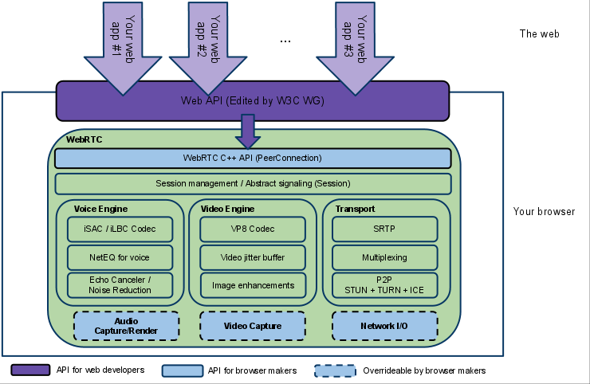            

架构图颜色标识说明：
- 紫色部分是Web开发者API层；
- 蓝色实线部分是面向浏览器厂商的API层；
- 蓝色虚线部分浏览器厂商可以自定义实现；

如上图我们可以看到，`WebRTC`有三个模块：
- Voice Engine（音频引擎）
  - Voice Engine包含iSAC/iLBC Codec（音频编解码器，前者是针对宽带和超宽带，后者是针对窄带）；
  - NetEQ for voice（处理网络抖动和语音包丢失）；
  - Echo Canceler（回声消除器）/ Noise Reduction（噪声抑制）；
- Video Engine（视频引擎）
  - VP8 Codec（视频图像编解码器）；
  - Video jitter buffer（视频抖动缓冲器，处理视频抖动和视频信息包丢失）；
  - Image enhancements（图像质量增强）；
- Transport（数据传输）
  - `SRTP`（安全的实时传输协议，用以音视频流传输）；
  - Multiplexing（多路复用）；
  - `P2P`，`STUN`+`TURN`+`ICE`（用于`NAT`网络和防火墙穿越的）；
  - 除此之外，安全传输可能还会用到`DTLS`（数据报安全传输），用于加密传输和密钥协商；
  - 整个`WebRTC`通信是基于UDP的；

## 核心组件
- 音视频引擎：`OPUS`、`VP8` / `VP9`、`H264`；
- 传输层协议：底层传输协议为 UDP；
- 媒体协议：`SRTP` / `SCTP`；
- 数据协议：`DTLS` / `SCTP`；
- P2P 内网穿透：`STUN` / `TURN` / `ICE` / `Trickle ICE`；
- 信令与 `SDP` 协商：`HTTP` / `WebSocket` / `SIP`、 `Offer Answer` 模型；

## `WebRTC`音视频引擎
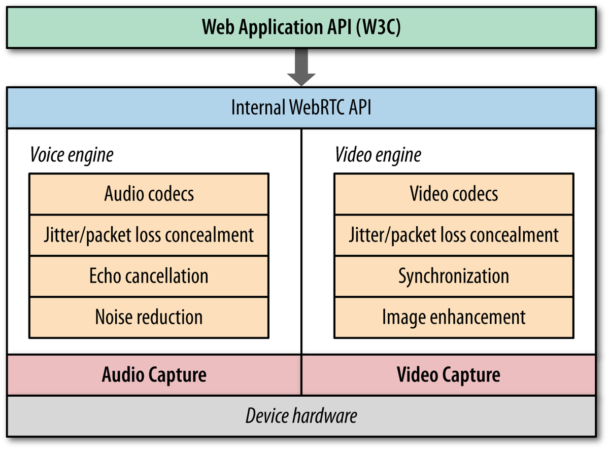
              
- 最底层是硬件设备，上面是音频捕获模块和视频捕获模块；
- 中间部分为音视频引擎。音频引擎负责音频采集和传输，具有降噪、回声消除等功能。视频引擎负责网络抖动优化，互联网传输编解码优化；
- 在音视频引擎之上是 一套 `C++` API，在 `C++` 的 API 之上是提供给浏览器的`Javascript API`；

## `WebRTC`协议栈
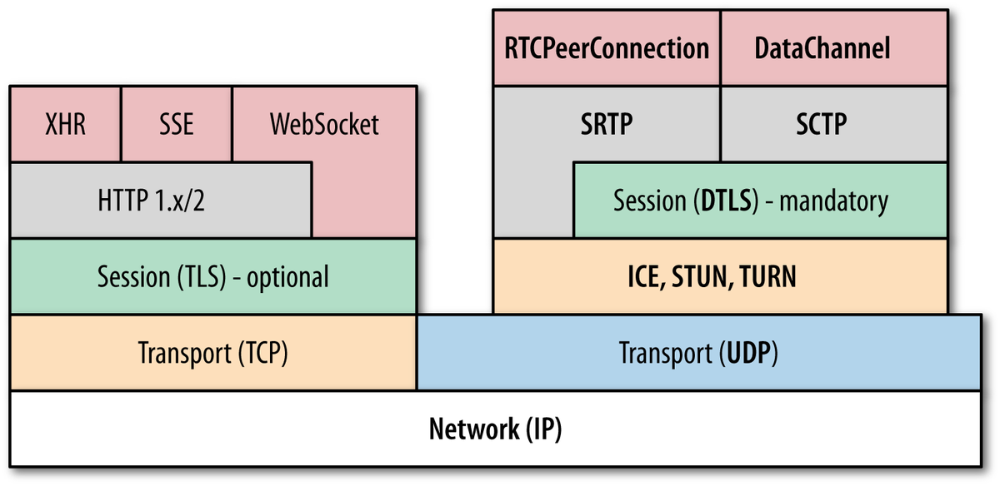
            
- `WebRTC` 核心的协议都是在右侧基于 `UDP` 基础上搭建起来的；
- 其中，`ICE`、`STUN`、`TURN` 用于内网穿透, 解决了获取与绑定外网映射地址，以及 `keep alive` 机制；
- `DTLS` 用于对传输内容进行加密，可以看做是 UDP 版的 TLS。由于 `WebRTC` 对安全比较重视，这一层是必须的。所有`WebRTC`组件都必须加密，并且其`JavaScript API`只能用于安全源（`HTTPS`或本地主机）。信令机制并不是由`WebRTC`标准定义的，所以必须确保使用安全协议；
- `SRTP` 与 SCTP 是对媒体数据的封装与传输控制协议；
- `SCTP` 是流控制传输协议，提供类似 TCP 的特性，SCTP 可以基于 UDP 上构建，在 `WebRTC` 里是在 `DTLS` 协议之上；
- `RTCPeerConnection` 用来建立和维护端到端连接，并提供高效的音视频流传输；
- `RTCDataChannel` 用来支持端到端的任意二进制数据传输；
- `WebRTC` 协议栈解释：
  - `ICE`：互动式连接建立（RFC 5245）；
  - `STUN`：用于`NAT`的会话遍历实用程序（RFC 5389）；
  - `TURN`：在`NAT`周围使用继电器进行遍历（RFC 5766）；
  - `SDP`：会话描述协议（RFC 4566）；
  - `DTLS`：数据报传输层安全性（RFC 6347）；
  - `SCTP`：流控制传输协议（RFC 4960）；
  - `SRTP`：安全实时传输协议（RFC 3711）；

现在看到这些千奇百怪的协议，俺也是一头雾水(¬_¬)，换个角度接着学习。
# `WebRTC`通话原理
我们可以一起思考以下一次`WebRTC`通话的难点痛点。比如，在两个完全不同的网络环境、多媒体硬件的设备上，如何进行实时的音视频通话？
## 媒体协商
首先两端之间应该协商好彼此支持的媒体格式。
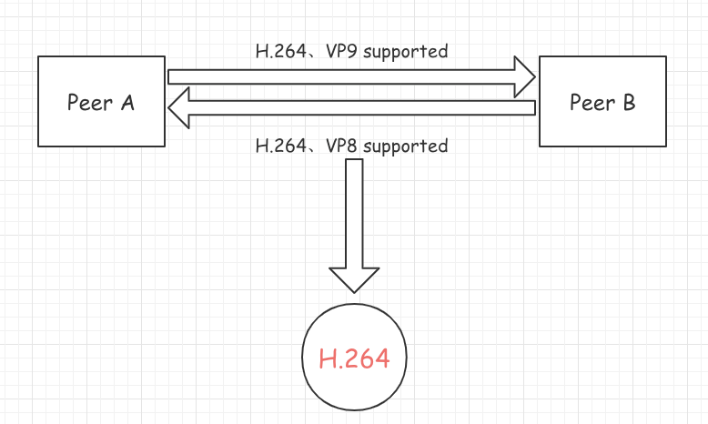
            
如上图假设有两个设备Peer A以及Peer B，通过协商两台设备知道彼此兼容的视频编解码器是H.264。
因此要完成媒体信息的交换，就要用到上述的`SDP`协议了。

> `SDP`，会话描述协议（Session Description Protocol或简写`SDP`）描述的是流媒体的初始化参数。此协议由IETF发表为 RFC 2327。 `SDP`最初的时候是会话发布协议（Session Announcement Protocol或简写SAP）的一个部件，1998年4月推出第一版，但是之后被广泛用于和RTSP以及SIP协同工作，也可被单独用来描述多播会话。
——Wikipedia

因此，在`WebRTC`中，媒体能力最终通过 `SDP` 呈现。在传输媒体数据之前，首先要进行媒体能力协商，看双方都支持那些编码方式，支持哪些分辨率等。协商的方法是通过信令服务器交换媒体能力信息。

              
            
`WebRTC` 媒体协商的过种如上图所示。
- 第一步，Amy 调用 `createOffer` 方法创建 offer 消息。offer 消息中的内容是 Amy 的 `SDP` 信息。
- 第二步，Amy 调用 `setLocalDescription` 方法，将本端的 `SDP` 信息保存起来。
- 第三步，Amy 将 offer 消息通过信令服务器传给 Bob。
- 第四步，Bob 收到 offer 消息后，调用 setRemoteDescription 方法将其存储起来。
- 第五步，Bob 调用 `createAnswer` 方法创建 answer 消息， 同样，answer 消息中的内容是 Bob 的 `SDP` 信息。
- 第六步，Bob 调用 `setLocalDescription` 方法，将本端的 `SDP` 信息保存起来。
- 第七步，Bob 将 anwser 消息通过信令服务器传给 Amy。
- 第八步，Amy 收到 answer 消息后，调用 `setRemoteDescription` 方法，将其保存起来。

我们可以用`Javascript`模拟一下这个过程：
```javascript
// 此处模拟一个信令服务，就是一个用来交换端和端之间SDP的信令服务
const signaling = new SignalingChannel(); 
// 建立一个RTC端
const pc = new RTCPeerConnection(null);
// 当两台设备需要进行媒体数据的协商时，触发如下方法
pc.onnegotiationneeded = async () => {
    // 创建offer 并local保存
    await pc.setLocalDescription(await pc.createOffer());
    // 然后调用信令服务将数据进行传输
    signaling.send({desc: pc.localDescription});
};

// 使用信令服务做SDP信息的交换
signaling.onmessage = async ({desc}) => {
    if (desc) {
        // 收到SDP offer则需要进行SDP answer
        if (desc.type === 'offer') {
            await pc.setRemoteDescription(desc); // 保存remote SDP
            // 设置local SDP, 并answer remote
            await pc.setLocalDescription(await pc.createAnswer());
            // 通过信令传递
            signaling.send({desc: pc.localDescription});
        } else if (desc.type === 'answer') {
            // 如果收到的是answer，local端进行存储，此时媒体信息交换完成
            await pc.setRemoteDescription(desc);
        }
    }
};
```
对于媒体格式，日后会想办法深入研究一下。
## 网络协商
彼此要了解对方的网络情况，这样才有可能找到一条相互通讯的链路。
这里首先要总结一下结论，然后跳进另一个漫长的复杂的我也没搞太明白的话题。

网络协商的理想步骤是：
- 获取当前端的外网IP地址映射
- 通过信令服务交换网络信息：上述代码中的信令常量signaling

问题二连：
- 但如何获取当前端的外网IP地址映射？
- 为什么要区分内外网IP？

一个关于`IPv4`的小故事
> 注：下边的故事内容源自网络🐒：

2011年2月3日中国农历新年， IANA对外宣布：`IPv4`地址空间最后5个地址块已经被分配给下属的5个地区委员会。2011年4月15日，亚太区委员会APNIC对外宣布，除了个别保留地址外，本区域所有的`IPv4`地址基本耗尽。一时之间，`IPv4`地址作为一种濒危资源身价陡增，各大网络公司出巨资收购剩余的空闲地址。其实，`IPv4`地址不足问题已不是新问题，早在20年以前，`IPv4`地址即将耗尽的问题就已经摆在Internet先驱们面前。这不禁让我们想去了解，是什么技术使这一危机延缓了尽20年。

`IPv4`即网际网协议第4版——Internet Protocol Version 4的缩写。`IPv4`定义一个跨越异种网络互连的超级网，它为每个网际网的节点分配全球唯一IP地址。如果我们把Internet比作一个邮政系统，那么IP地址的作用就等同于包含城市、街区、门牌编号在内的完整地址。`IPv4`使用32bits整数表达一个地址，地址最大范围就是232 约为43亿。以IP创始时期可被联网的设备来看，这样的一个空间已经很大，很难被短时间用完。然而，事实远远超出人们的设想，计算机网络在此后的几十年里迅速壮大，网络终端数量呈爆炸性增长。

更为糟糕的是，为了路由和管理方便，43亿的地址空间被按照不同前缀长度划分为A,B,C,D类地址网络和保留地址。其中，A类网络地址127段，每段包括主机地址约1678万个。B类网络地址16384段，每段包括65536个主机地址。

IANA向超大型企业/组织分配A类网络地址，一次一段。向中型企业或教育机构分配B类网络地址，一次一段。这样一种分配策略使得IP地址浪费很严重，很多被分配出去的地址没有真实被利用，地址消耗很快。以至于二十世纪90年代初，网络专家们意识到，这样大手大脚下去，`IPv4`地址很快就要耗光了。于是，人们开始考虑`IPv4`的替代方案，同时采取一系列的措施来减缓`IPv4`地址的消耗。

Internet起初希望大家互联起来，通过IP地址来保证互联的唯一且准确，但万万没想到加入互联网的设备终端居然有这么这么多。于是便出现了`NAT`技术，事实证明`NAT`有助于减缓可用的IP地址空间的枯竭。在RFC2663中有对`NAT`具体的说明。

### `NAT` & `NAT`穿透
`NAT`即网络地址转换，就是替换IP报文头部的地址信息。`NAT`通常部署在一个组织的网络出口位置，通过将内部网络IP转换为出口的IP地址提供公网可达以及和上层协议的连接能力。

RFC1918规定了三个保留地址段落：
- 10.0.0.0-10.255.255.255
- 172.16.0.0-172.31.255.255
- 192.168.0.0-192.168.255.255

这三个范围分别处于A,B,C类的地址段，不向特定的用户分配，被IANA作为私有地址保留。这些地址可以在任何组织或企业内部使用，和其他Internet地址的区别就是，仅能在内部使用，不能作为全球路由地址。对于有Internet访问需求而内部又使用私有地址的网络，就要在组织的出口位置部署`NAT`网关，在报文离开私网进入Internet时，将源IP替换为公网地址，通常是出口设备的接口地址。一个对外的访问请求在到达目标以后，表现为由本组织出口设备发起，因此被请求的服务端可将响应由Internet发回出口网关。出口网关再将目的地址替换为私网的源主机地址，发回内部。这样一次由私网主机向公网服务端的请求和响应就在通信两端均无感知的情况下完成了。依据这种模型，数量庞大的内网主机就不再需要公有IP地址了。

所有`NAT`都可分为几类：
1. 静态`NAT`：
将单个私有IP地址与单个公共地址映射，即将私有IP地址转换为公共IP地址。
2. 动态`NAT`：
在这种类型的`NAT`中，多个专用IP地址映射到公用IP地址池。当我们知道固定用户想要在给定的时间点访问Internet的数量时，将使用它。
3. PAT（`NAT`重载）：
使用`NAT`重载可以将许多本地（专用）IP地址转换为单个公用IP地址。端口号用于区分流量，即哪个流量属于哪个IP地址。这是最常用的方法，因为它具有成本效益，因为仅使用一个真实的全局（公共）IP地址就可以将数千个用户连接到Internet。

### `STUN`协议
#### 简介
`STUN`协议全称Simple traversal of UDP over `NAT`s protocol，是一种网络协议，它允许位于`NAT`后的客户端找出自己的公网地址，查出自己位于哪种类型的`NAT`之后以及`NAT`为某一个本地端口所绑定的Internet端端口。这些信息被用来在两个同时处于`NAT`路由器之后的主机之间创建UDP通信。默认端口号是3478。它将`NAT`实现分为四种：
分类
1. Full-cone `NAT`，aka one-to-one `NAT`
- 完全锥形`NAT`，所有从同一个内网IP和端口号发送过来的请求都会被映射成同一个外网IP和端口号，并且任何一个外网主机都可以通过这个映射的外网IP和端口号向这台内网主机发送包。
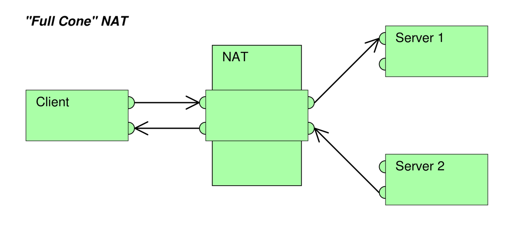

              
            
2. (Address)-restricted-cone `NAT`
- 限制锥形`NAT`，它也是所有从同一个内网IP和端口号发送过来的请求都会被映射成同一个外网IP和端口号。与完全锥形不同的是，外网主机只能够向先前已经向它发送过数据包的内网主机发送包。


              
            
3. Port-restricted cone `NAT`
- 端口限制锥形`NAT`，与限制锥形`NAT`很相似，只不过它包括端口号。也就是说，一台IP地址X和端口P的外网主机想给内网主机发送包，必须是这台内网主机先前已经给这个IP地址X和端口P发送过数据包。
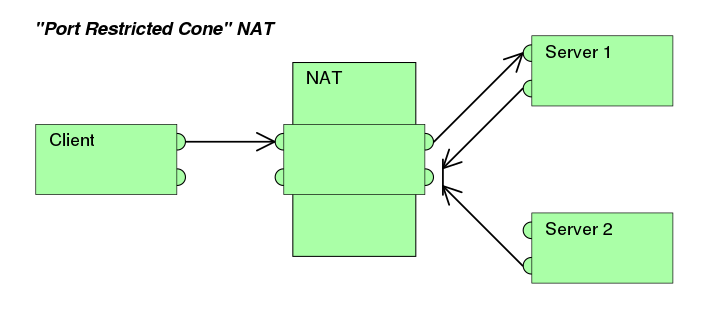
              
            
4. Symmetric `NAT`
- 对称`NAT`，所有从同一个内网IP和端口号发送到一个特定的目的IP和端口号的请求，都会被映射到同一个IP和端口号。如果同一台主机使用相同的源地址和端口号发送包，但是发往不同的目的地，`NAT`将会使用不同的映射。此外，只有收到数据的外网主机才可以反过来向内网主机发送包。
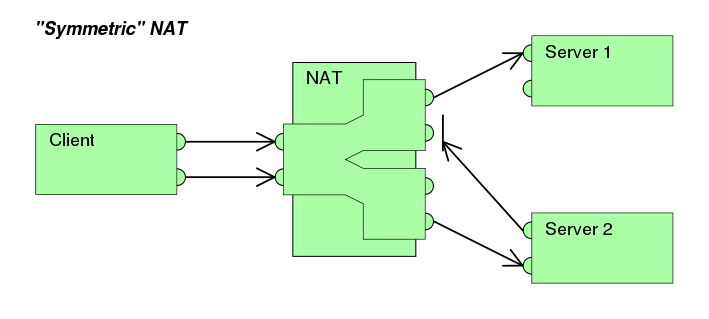
              
            
#### 方案
一旦客户端得知了Internet端的UDP端口，通信就可以开始了。如果`NAT`是完全圆锥型的，那么双方中的任何一方都可以发起通信。如果`NAT`是受限圆锥型或端口受限圆锥型，双方必须一起开始传输。

需要注意的是，要使用`STUN` RFC中描述的技术并不一定需要使用`STUN`协议，还可以另外设计一个协议并把相同的功能集成到运行该协议的服务器（`TURN`）上。

SIP之类的协议是使用UDP分组在Internet上传输音频／视频数据的。不幸的是，由于通信的两个末端往往位于`NAT`之后，因此用传统的方法是无法创建连接的。这也就是`STUN`发挥作用的地方。

`STUN`是一个CS协议。一个VoIP电话或软件包可能会包括一个`STUN`客户端，而`WebRTC`中的RTCPeerConnection接口则给予了我们直接调用`STUN`服务器的能力。这个客户端会向`STUN`服务器发送请求，之后，服务器就会向`STUN`客户端报告`NAT`路由器的公网IP地址以及`NAT`为允许传入流量传回内网而开通的端口，以组装正确的UDP数据包。

以上的响应同时还使得`STUN`客户端能够确定正在使用的`NAT`类型——因为不同的`NAT`类型处理传入的UDP分组的方式是不同的。四种主要类型中有三种是可以使用的：完全圆锥型`NAT`、受限圆锥型`NAT`和端口受限圆锥型`NAT`——但大型公司网络中经常采用的对称型`NAT`（又称为双向`NAT`）则不能使用。

#### 算法
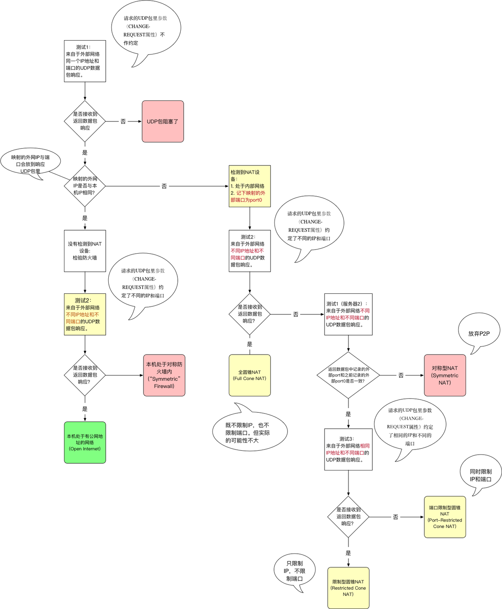

            
注：一旦路经通过红色箱子的终点时，UDP的沟通是没有可能性的。一旦通过黄色或是绿色的箱子，就有连线的可能。

### `TURN`协议
使用`TURN`协议可以穿透对称型`NAT`。`TURN`协议允许一台主机使用中继服务与对端进行报文传输。`TURN`不同于其它中继协议在于它允许客户机使用一个中继地址与多个对端同时进行通讯。完美弥补了`STUN`无法穿透对称型`NAT`的缺陷。

> RTCPeerConnection尝试通过UDP建立对等端之间的直接通信。
  如果失败的话，RTCPeerConnection就会使用TCP进行连接。如果使用TCP还失败的话，可以用 `TURN`服务器作为后备，在终端之间转发数据。
  重申： `TURN`用于中继对等端之间的音频/视频/数据流
  `TURN`服务器具有公共地址，因此即使对等端位于防火墙或代理之后也可以与其他人联系。 `TURN`服务器有一个概念上来讲简单的任务—中继数据流—但是与 `STUN`服务器不同的是，他们会消耗大量的带宽。换句话说， `TURN`服务器需要更加的强大。

具体原理俺接下来有机会再去深入，这次探究的重点并不在这里。
但重要的是，通过这两个协议，我们可以轻而易举的获取当前端的外网IP地址映射了。

### 部署`STUN`和`TURN`服务
注意`STUN`服务必须部署在拥有唯一公网IP的设备上。俺选择了阿里云ECS进行实验。
- `STUN`和 `TURN`服务器的源代码可从code.google.com/p/rfc5766-turn-server获得，该代码还提供了有关服务器安装的多个信息源的链接。
- Amazon Web Services的VM映像也可用。
- 另一个 `TURN`服务器是restund，提供源代码，也有AWS服务。

俺这里探究了另一款`STUN`服务，coturn：
coturn 服务器完整的实现了 `STUN`/`TURN` 协议，支持 P2P 穿透防火墙；
coturn 支持 TCP, UDP, TLS, DTLS连接；支持 Linux、macOS，暂不支持Windows。

部署步骤：

#### 阿里云面板配置
1. 在安全组中开启3478端口UDP出入规则，如下图：

            
2. 查看实例内网IP/外网IP并记录：

              
#### ECS实例部署服务
1. git clone / configure / make / make install 四连
```bash
git clone 'https://github.com/coturn/coturn cd coturn'
./configure 
make 
sudo make install

yum install libevent-devel # 如果你的电脑上没有安装LibEvent2，需要先安装libevent-devel
yum -y install openssl-devel # openSSL也要安装嗷
```
2. 配置文件
- 在Coturn编译完成好之后会自动生成一个配置文件模版，路径如下：`/usr/local/etc/turnserver.conf.default`
- 俺这里写一个最简配置`turnserver.conf.min`：
```bash
# server
listening-port=3478 # 服务监听端口，默认也是3478
listening-ip=172.16.205.16 # 服务监听的内网IP
external-ip=118.178.181.100  # 当前服务的外网IP
realm=stun.neotape.live # 域标志，不知道是什么意思，可以随便写
no-tls # 关掉TLS，最简服务 
no-dtls # DTLS同理
mobility # 这里也没有懂，开启Mobility ICE，即允许流在多个设备间移动？
no-cli # 禁止本地 telnet cli管理接口
verbose # 日志输出详细模式
fingerprint # 消息验证，WebRTC 的消息里会用到
lt-cred-mech # webrtc 通过 turn 中继，必须使用长验证方式
stale-nonce=3600 # 可为 TURN 服务提供更安全的访问
user=neo:tape # 设置一个用户，这里可以设置多个或者使用数据库
```
 全部的命令和配置见git上coturn的wiki：https://github.com/coturn/coturn/wiki/turnserver
3. 启动服务
```bash
turnserver -c turnserver.conf.min # 服务就启动了，可以观察观察服务的日志
```
4. 验证服务是否好使
- https://webrtc.github.io/samples/src/content/peerconnection/trickle-ice/
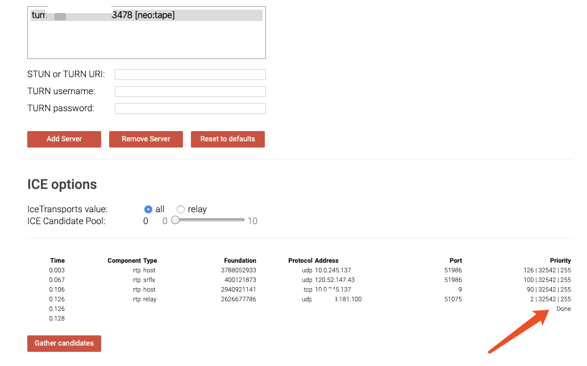
`TURN`服务验证   
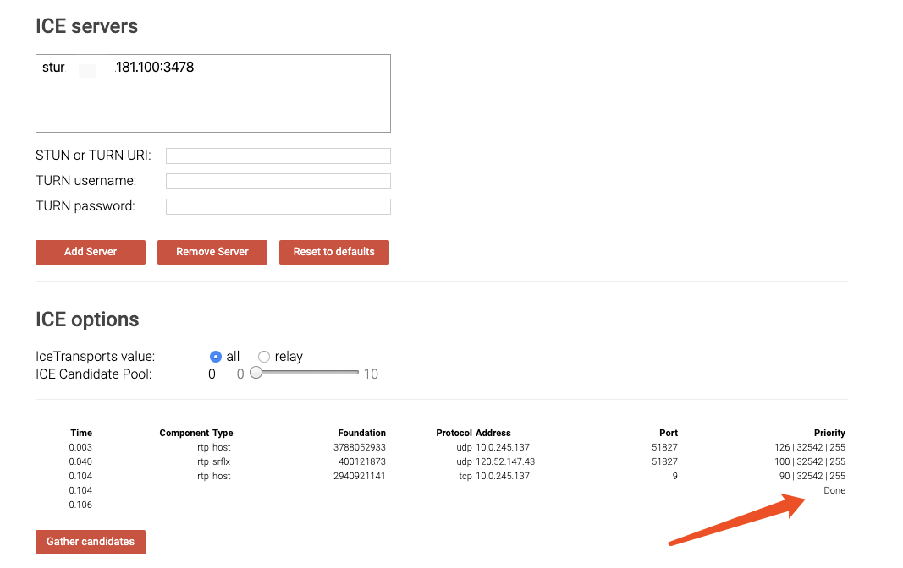 
`STUN`服务验证
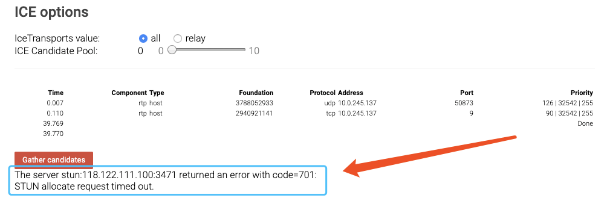 
如果失败了，会得到相应的错误提示，比如下图这个Timeout错误：

以上便是是`WebRTC`中经常用到的2个协议，`STUN`和`TURN`服务器我们使用的coturn开源项目。至此，获取当前端的外网IP地址映射的任务完成了。

注明一点：ICE跟`STUN`和`TURN`不一样，ICE不是一种协议，而是一个框架（Framework），它整合了`STUN`和`TURN`。coturn开源项目集成了`STUN`和`TURN`的功能。

### 交换网络信息
在`WebRTC`中用来描述 网络信息的术语叫candidate。

然后我们需要使用信令服务来对两端之间的candidate信息做交换：
```javascript
// 和上述例子比，多做了一些微小的工作
const signaling = new SignalingChannel();
// 配置过的STUN服务
const configuration = {iceServers: [{urls: 'stuns:stun.example.org'}]};
// 创建RTCPeerConnection的时候便可把STUN/TURN的配置一并写在其中
const pc = new RTCPeerConnection(configuration);
// 本地代理ICE需要通过信令服务器传递信息给其他对等端时就会触发
pc.onicecandidate = ({candidate}) => signaling.send({candidate});
pc.onnegotiationneeded = async () => {
  try {
    await pc.setLocalDescription(await pc.createOffer());
    signaling.send({desc: pc.localDescription});
  } catch (err) {
    console.error(err);
  }};

signaling.onmessage = async ({desc, candidate}) => {
  try {
    if (desc) {
      if (desc.type === 'offer') {
        await pc.setRemoteDescription(desc);
        const stream =
          await navigator.mediaDevices.getUserMedia(constraints);
        stream.getTracks().forEach((track) =>
          pc.addTrack(track, stream));
        await pc.setLocalDescription(await pc.createAnswer());
        signaling.send({desc: pc.localDescription});
      } else if (desc.type === 'answer') {
        await pc.setRemoteDescription(desc);
      } else {
        console.log('Unsupported SDP type.');
      }
    } else if (candidate) {
      // 获取对端的candidate信息，做一个保存，此时连接已经正常建立
      await pc.addIceCandidate(candidate);
    }
  } catch (err) {
    console.error(err);
  }};
```
## 信令服务器
`WebRTC`中间无法创建没有某种服务器的连接。 我们称之为信号通道（信令）。 无论是通过电子邮件，明信片还是一只信鸽...，都可以通过任何通信方式交换信息，这取决于你。不过这也恰恰导致建立信令服务的方式的多样性，只要能保证要进行RTC的两端能正确接收到彼此的`SDP`以及candidate并保存即可。俺用socket.io来实现简单的信令服务：
```javascript
const os = require('os'); // operating system lib
const nss = require('node-static'); // node-static-server lib
const http = require('http'); // node http lib
const socketIO = require('socket.io'); // socket.io lib

const fs = new (nss.Server)('./server/template'); // fs here is not file system :( but file server :) anyway

// create an server
const app = http.createServer((req, res) => {
    fs.serve(req, res);
}).listen(8080);

const io = socketIO.listen(app); // load socket.io listening to http server created before

// when io found client connected
io.sockets.on('connection', function (socket) {

    // convenience func to notify server messages to the client
    function notify() {
        let array = ['[[[Server Notifications]]]:']; // init message list
        array.push.apply(array, arguments); // push args to message list
        socket.emit('notify', array); // emit messages
    }

    // got message then resend to other client
    socket.on('message', function (message) {
        notify('Client said:', message);
        socket.broadcast.emit('message', message); // broadcast the message to other clients, but here maximum client nums is 2
    });

    socket.on('create or join', function (room) {
        notify('Received request to create or join room: ' + room);
        let clientsInRoom = io.sockets.adapter.rooms[room]; // found members in room now
        let nums = clientsInRoom ? Object.keys(clientsInRoom.sockets).length : 0;
        notify(`Room ${room} now has ${nums} client(s)`);

        // if no members in current room
        if (nums === 0) {
            socket.join(room); // create new room
            notify(`Client ID ${socket.id} created room ${room}`);
            socket.emit('created', room, socket.id); // emit signal to client that room created successfully
        } else if (nums === 1) {
            notify(`Client ID ${socket.id} joined room ${room}`);
            io.sockets.in(room).emit('join', room); // emit join signal to the peer now in the room
            socket.join(room); // join to the room
            socket.emit('joined', room, socket.id); // emit signal to client that room joined successfully
            io.sockets.in(room).emit('ready'); // when both of two clients are here in room now, emit ready to both of them
        } else { // max two clients
            socket.emit('full', room);
        }
    });

    socket.on('ipaddr', function () {
        const ifaces = os.networkInterfaces(); // get network interfaces
        for (let dev in ifaces) {
            ifaces[dev].forEach(function (details) {
                if (details.family === '`IPv4`' && details.address !== '127.0.0.1') {
                    socket.emit('ipaddr', details.address); // emit server ip address to socket
                }
            })
        }
    });

    // bye handler
    socket.on('bye', function () {
        console.log('received bye from client');
        notify('bye~');
    });
});
```
## 总结
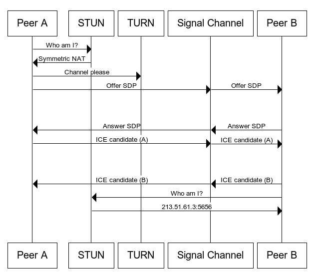
通过信令服务、`STUN`&`TURN`服务，我们便可以完成`WebRTC`通话建立的全部过程。上图便简单的反映了建立连接的大体情况。

`WebRTC Javascript APIs`
- getUserMedia()：捕捉音频和视频
- RTCPeerConnection：在用户之间流式传输音频和视频
- RTCDataChannel：在用户之间传输数据
- MediaRecorder：录制音频和视频

利用这些API，我们可以在Web实现很多有趣的RTC功能。

# `WebRTC`浏览器兼容性 ——webrtc-adapter
## 由来
> adapter.js自2012年底或者2013年初`WebRTC`早期的时候就已经出现了。它是一个非常小的项目，当时还没有150行。主要功能是隐藏像webkitRTCPeerConnection和mozRTCPeerConnection这样的前缀差异，并提供函数将MediaStream附加到HTML的或元素。随着各个游览器对webrtc的支持， adapter.js用来屏蔽各个游览器之间的差异，对外提供统一的接口，其复杂程度也越来越高，目前超过2200行代码。 
## 使用
- https://www.npmjs.com/package/webrtc-adapter 模块引入
- https://webrtc.github.io/adapter/adapter-latest.js 脚本引入
# `WebRTC` 音视频通话
## 安全源限制
由于主流浏览器安全源策略的问题，若访问的地址非本地主机或HTTPS地址，音视频能力与`WebRTC` Javascript API默认无法获得。解决方案有两个：
1. 使用终端开启chrome并添加  --unsafely-treat-insecure-origin-as-secure="http://xxx"命令
2. 使用https（WebSocket则还需开启wss） 
- 比如俺，俺用nginx转发443端口到node服务，因此还需要对ws做额外的转发：
location /ws/ {
    proxy_pass http://127.0.0.1:8080;
    proxy_http_version 1.1;
    proxy_set_header Upgrade $http_upgrade;
    proxy_set_header Connection "upgrade";
    proxy_set_header X-Forwarded-For $proxy_add_x_forwarded_for;
    proxy_set_header Host $host;
    proxy_set_header X-Real-IP $remote_addr;
}
## getUserMedia API
### 简介  

MediaDevices.getUserMedia() 会提示用户给予使用媒体输入的许可，媒体输入会产生一个MediaStream，里面包含了请求的媒体类型的轨道。此流可以包含一个视频轨道（来自硬件或者虚拟视频源，比如相机、视频采集设备和屏幕共享服务等等）、一个音频轨道（同样来自硬件或虚拟音频源，比如麦克风、A/D转换器等等），也可能是其它轨道类型。  

它返回一个 Promise 对象，成功后会resolve回调一个 MediaStream 对象。若用户拒绝了使用权限，或者需要的媒体源不可用，promise会reject回调一个  PermissionDeniedError 或者 NotFoundError 。  

返回的promise对象可能既不会resolve也不会reject，因为用户不是必须选择允许或拒绝。  

通常你可以使用 navigator.mediaDevices 来获取 MediaDevices ，例如：  

```javascript
navigator.mediaDevices.getUserMedia(constraints)
.then(function(stream) {
  /* 使用这个stream stream */
})
.catch(function(err) {
  /* 处理error */
});
```

###  语法  

```javascript
var promise = navigator.mediaDevices.getUserMedia(constraints)
```

### 参数  

**constraints**，  

作为一个MediaStreamConstraints 对象，指定了请求的媒体类型和相对应的参数。  

`constraints` 参数是一个包含了`video` 和 `audio`两个成员的MediaStreamConstraints 对象，用于说明请求的媒体类型。必须至少一个类型或者两个同时可以被指定。如果浏览器无法找到指定的媒体类型或者无法满足相对应的参数要求，那么返回的Promise对象就会处于rejected［失败］状态，NotFoundError作为rejected［失败］回调的参数。   

以下同时请求不带任何参数的音频和视频：`{ audio: true, video: true }`  

如果为某种媒体类型设置了 true ，得到的结果的流中就需要有此种类型的轨道。如果其中一个由于某种原因无法获得，getUserMedia() 将会产生一个错误。  

当由于隐私保护的原因，无法访问用户的摄像头和麦克风信息时，应用可以使用额外的constraints参数请求它所需要或者想要的摄像头和麦克风能力。下面演示了应用想要使用1280x720的摄像头分辨率：  

```javascript
{
  audio: true,
  video: { width: 1280, height: 720 }
}
```

浏览器会试着满足这个请求参数，但是如果无法准确满足此请求中参数要求或者用户选择覆盖了请求中的参数时，有可能返回其它的分辨率。  

强制要求获取特定的尺寸时，可以使用关键字min, max, 或者 exact(就是 min == max). 以下参数表示要求获取最低为1280x720的分辨率。  

```javascript
{
  audio: true,
  video: {
    width: { min: 1280 },
    height: { min: 720 }
  }
}
```

如果摄像头不支持请求的或者更高的分辨率，返回的Promise会处于rejected状态，NotFoundError作为rejected回调的参数，而且用户将不会得到要求授权的提示。  

造成不同表现的原因是，相对于简单的请求值和ideal关键字而言，关键字min, max, 和 exact有着内在关联的强制性，请看一个更详细的例子：  

```javascript
{
  audio: true,
  video: {
    width: { min: 1024, ideal: 1280, max: 1920 },
    height: { min: 776, ideal: 720, max: 1080 }
  }
}
```

当请求包含一个ideal（应用最理想的）值时，这个值有着更高的权重，意味着浏览器会先尝试找到最接近指定的理想值的设定或者摄像头（如果设备拥有不止一个摄像头）。  

简单的请求值也可以理解为是应用理想的值，因此我们的第一个指定分辨率的请求也可以写成如下：  

```javascript
{
  audio: true,
  video: {
    width: { ideal: 1280 },
    height: { ideal: 720 }
  }
}
```

并不是所有的constraints 都是数字。例如, 在移动设备上面，如下的例子表示优先使用前置摄像头（如果有的话）：  

```javascript
{ audio: true, video: { facingMode: "user" } }
```

强制使用后置摄像头，请用：  

```javascript
{ audio: true, video: { facingMode: { exact: "environment" } } }
```

### 返回值  

返回一个 [Promise](https://developer.mozilla.org/zh-CN/docs/Web/JavaScript/Reference/Global_Objects/Promise) ， 这个Promise成功后的回调函数带一个 [MediaStream](https://developer.mozilla.org/zh-CN/docs/Web/API/MediaStream) 对象作为其参数。  

### 异常  

返回一个失败状态的Promise，这个Promise失败后的回调函数带一个DOMException对象作为其参数。 可能的异常有：  

* AbortError［中止错误］  
  尽管用户和操作系统都授予了访问设备硬件的权利，而且未出现可能抛出NotReadableError异常的硬件问题，但仍然有一些问题的出现导致了设备无法被使用。  

* NotAllowedError［拒绝错误］
  用户拒绝了当前的浏览器实例的访问请求；或者用户拒绝了当前会话的访问；或者用户在全局范围内拒绝了所有媒体访问请求。  
  较旧版本的规范使用了SecurityError，但在新版本当中SecurityError被赋予了新的意义。  

* NotFoundError［找不到错误］  
  找不到满足请求参数的媒体类型。  

* NotReadableError［无法读取错误］  
  尽管用户已经授权使用相应的设备，操作系统上某个硬件、浏览器或者网页层面发生的错误导致设备无法被访问。  

* OverConstrainedError［无法满足要求错误］  
  指定的要求无法被设备满足，此异常是一个类型为OverconstrainedError的对象，拥有一个constraint属性，这个属性包含了当前无法被满足的constraint对象，还拥有一个message属性，包含了阅读友好的字符串用来说明情况。  
  因为这个异常甚至可以在用户尚未授权使用当前设备的情况下抛出，所以应当可以当作一个探测设备能力属性的手段［fingerprinting surface］。  

* SecurityError［安全错误］  
  在getUserMedia() 被调用的 Document 上面，使用设备媒体被禁止。这个机制是否开启或者关闭取决于单个用户的偏好设置。  

* TypeError［类型错误］  
  constraints对象未设置［空］，或者都被设置为false。  

### 示例  

####  宽度和高度  

这个例子设置了摄像头分辨率，并把结果的 [MediaStream](https://developer.mozilla.org/zh-CN/docs/Web/API/MediaStream) 分配给了一个video元素。  

```javascript
// 想要获取一个最接近 1280x720 的相机分辨率
var constraints = { audio: true, video: { width: 1280, height: 720 } };

navigator.mediaDevices.getUserMedia(constraints)
.then(function(mediaStream) {
  var video = document.querySelector('video');
  video.srcObject = mediaStream;
  video.onloadedmetadata = function(e) {
    video.play();
  };
})
.catch(function(err) { console.log(err.name + ": " + err.message); }); // 总是在最后检查错误
```

### 在旧的浏览器中使用新的API  

这是一个使用 navigator.mediaDevices.getUserMedia()的例子，带一个polyfill以适应旧的浏览器。 要注意的是这个polyfill并不能修正一些约束语法上的遗留差异，这表示约束在某些浏览器上可能不会很好地运行。推荐使用处理了约束的 adapter.js polyfill 来替代。  

```javascript
// 老的浏览器可能根本没有实现 mediaDevices，所以我们可以先设置一个空的对象
if (navigator.mediaDevices === undefined) {
  navigator.mediaDevices = {};
}

// 一些浏览器部分支持 mediaDevices。我们不能直接给对象设置 getUserMedia
// 因为这样可能会覆盖已有的属性。这里我们只会在没有getUserMedia属性的时候添加它。
if (navigator.mediaDevices.getUserMedia === undefined) {
  navigator.mediaDevices.getUserMedia = function(constraints) {

    // 首先，如果有getUserMedia的话，就获得它
    var getUserMedia = navigator.webkitGetUserMedia || navigator.mozGetUserMedia;

    // 一些浏览器根本没实现它 - 那么就返回一个error到promise的reject来保持一个统一的接口
    if (!getUserMedia) {
      return Promise.reject(new Error('getUserMedia is not implemented in this browser'));
    }

    // 否则，为老的navigator.getUserMedia方法包裹一个Promise
    return new Promise(function(resolve, reject) {
      getUserMedia.call(navigator, constraints, resolve, reject);
    });
  }
}

navigator.mediaDevices.getUserMedia({ audio: true, video: true })
.then(function(stream) {
  var video = document.querySelector('video');
  // 旧的浏览器可能没有srcObject
  if ("srcObject" in video) {
    video.srcObject = stream;
  } else {
    // 防止再新的浏览器里使用它，应为它已经不再支持了
    video.src = window.URL.createObjectURL(stream);
  }
  video.onloadedmetadata = function(e) {
    video.play();
  };
})
.catch(function(err) {
  console.log(err.name + ": " + err.message);
});
```

### 帧率  

在某些情况下，比如`WebRTC`上使用受限带宽传输时，低帧率可能更适宜。  

```javascript
var constraints = { video: { frameRate: { ideal: 10, max: 15 } } };
```

### 前置或者后置摄像头  

在移动设备（电话）上  

```javascript
var front = false;
document.getElementById('flip-button').onclick = function() { front = !front; };

var constraints = { video: { facingMode: (front? "user" : "environment") } };
```

### 权限  

在一个可安装的app（如Firefox OS app）中使用 `getUserMedia`() ，你需要在声明文件中指定以下的权限：  

```javascript
"permissions": {
  "audio-capture": {
    "description": "Required to capture audio using getUserMedia()"
  },
  "video-capture": {
    "description": "Required to capture video using getUserMedia()"
  }
}
```

## 视频流的获取以及传输
```javascript
// Client端
// RTCPeerConnection假设已经创建好了
const pc = new RTCPeerConnection({...configs});

// 获取视频流
navigator.mediaDevices.getUserMedia({
    audio: false,
    video: true
})
    .then(gotStream)
    .catch(function (e) {
        alert('getUserMedia() error: ' + e.name);
    });

// 获取本地视频流后
function gotStream(stream) {
    localVideo.srcObject = stream;
    sendMessage('got user media'); // 通知对端建立链接
    // 如果是主动发起链接的端
    if (isInitiator) {
        maybeStart();
    } 
}

signaling.on('message', function(message) {
    if (message === 'got user media') {
        maybeStart();
    }
})

function maybeStart() {
    // isChannelReady 可以理解为当有两个设备同时加入会话时
    if (typeof localStream !== 'undefined' && isChannelReady) {
        console.log('>>>>>> creating peer connection');
        createPeerConnection();
        pc.addStream(localStream); // 加入本地的流以传输给对端
        // 如果是主动发起链接的端
        if (isInitiator) {
            doCall(); // 主动发起通话，进行SDP交换
        }
    }
}

function createPeerConnection() {
    try {
        pc = new RTCPeerConnection({...configs});
        pc.onicecandidate = handleIceCandidate;
        pc.onaddstream = handleRemoteStreamAdded; // 这个时候便已经获得了对端的视频流
    }
}
```

# `WebRTC` 数据传输
## RTCDataChannel API
https://developer.mozilla.org/zh-CN/docs/Web/API/RTCDataChannel
## 代码示例
```javascript
var pc = new RTCPeerConnection(servers,
  {optional: [{RtpDataChannels: true}]});

pc.ondatachannel = function(event) {
  receiveChannel = event.channel;
  receiveChannel.onmessage = function(event){
    document.querySelector("div#receive").innerHTML = event.data;
  };};

sendChannel = pc.createDataChannel("sendDataChannel", {reliable: false});

document.querySelector("button#send").onclick = function (){
  var data = document.querySelector("textarea#send").value;
  sendChannel.send(data);};
```
# 写在最后
## 俺的小Demo
打个电话8: https://neotape.live
## Debug `WebRTC` In Chrome
chrome://webrtc-internals/
## Video Chat for the Web Android and iOS：安卓iOS也可使用`WebRTC`
https://docs.google.com/presentation/d/1CjuTaY2J9P5xrFDtRCh6VmS7Iw2UBbm-JEwzCHQCYkE/edit#slide=id.g521d01055_1_141
## `WebRTC` & RTMP 比较：RTMP是直播使用比较多的场景
https://segmentfault.com/a/1190000018134618
## `WebRTC` Samples：一些示例
https://webrtc.github.io/samples/
## `WebRTC` in the real world：不错的文章
https://www.html5rocks.com/en/tutorials/webrtc/infrastructure/
## `WebRTC` Experiments：一些`WebRTC`实验
https://github.com/muaz-khan/WebRTC-Experiment
## `WebRTC`的前世今生：一篇很好的翻译
https://blog.coding.net/blog/getting-started-with-webrtc
## `WebRTC` 1.0: Real-time Communication Between Browsers：`WebRTC` API文档
https://www.w3.org/TR/webrtc/
## RTCMultiConnection.js：开源的`WebRTC`库
https://www.rtcmulticonnection.org/
## Pure Go implementation of the `WebRTC` API
https://github.com/pion/webrtc
